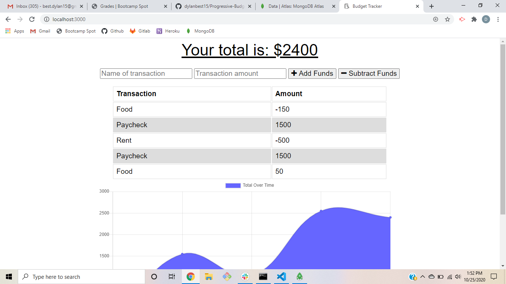

# Progressive-Budget
This app utilizes an Express server with a MongoDB database to allow the user to track their budget. They can add or subtract funds from their budget and a graph will autoatically update to show their transactions over time. In addition, this app utilizes a manifest.webmanifest, serviceworker.js, and an IndexedDB in order to completely function in an offline environment as a Progressive Web App. When offline, the user's transactions will be stored in the IndexedDB and the MongoDB will be automatically updated once the user returns online.

## Built With
- <a href="https://www.npmjs.com/package/express">Express NPM</a>
- <a href="https://www.mongodb.com/">MongoDB</a>
- <a href="https://www.npmjs.com/package/mongoose">Mongoose NPM</a>

## Screenshots

## Live Link

## License
Copyright ©2020 Dylan Best

Permission is hereby granted, free of charge, to any person obtaining a copy of this software and associated documentation files (the "Software"), to deal in the Software without restriction, including without limitation the rights to use, copy, modify, merge, publish, distribute, sublicense, and/or sell copies of the Software, and to permit persons to whom the Software is furnished to do so, subject to the following conditions:

The above copyright notice and this permission notice shall be included in all copies or substantial portions of the Software.

THE SOFTWARE IS PROVIDED "AS IS", WITHOUT WARRANTY OF ANY KIND, EXPRESS OR IMPLIED, INCLUDING BUT NOT LIMITED TO THE WARRANTIES OF MERCHANTABILITY, FITNESS FOR A PARTICULAR PURPOSE AND NONINFRINGEMENT. IN NO EVENT SHALL THE AUTHORS OR COPYRIGHT HOLDERS BE LIABLE FOR ANY CLAIM, DAMAGES OR OTHER LIABILITY, WHETHER IN AN ACTION OF CONTRACT, TORT OR OTHERWISE, ARISING FROM, OUT OF OR IN CONNECTION WITH THE SOFTWARE OR THE USE OR OTHER DEALINGS IN THE SOFTWARE.

## Authors
- **Dylan Best** - [dylanbest15](https://github.com/dylanbest15)